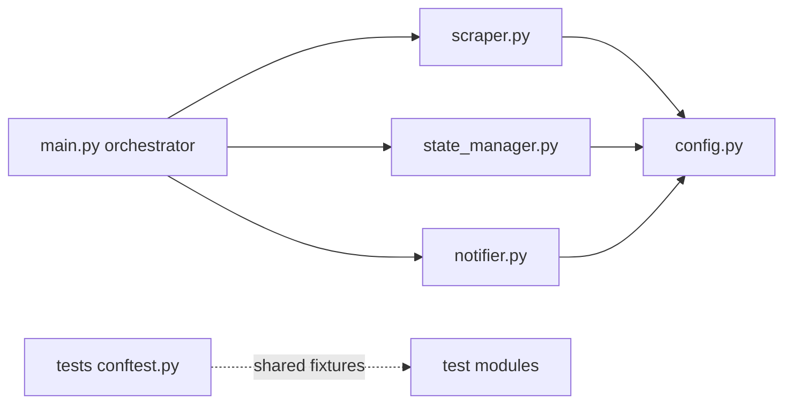
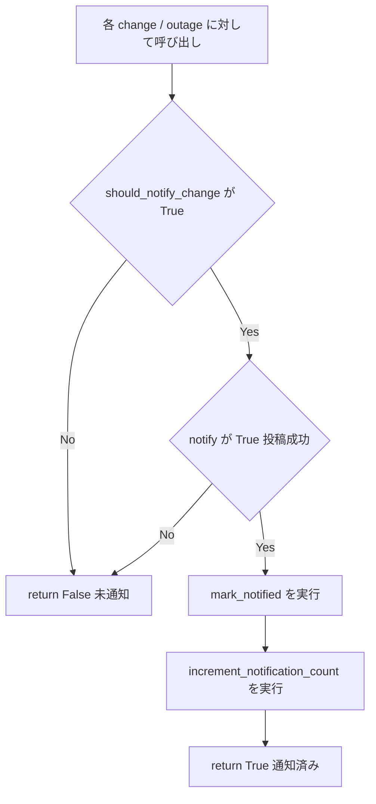

# 技術設計書: code-refactoring

## Overview

**Purpose**: 本リファクタリングは、としまテレビ障害通知システムを保守する開発者に対し、可読性・保守性の向上という価値を提供する。外部から観測可能な振る舞い（スクレイピング抽出結果、通知文面、`data/state.json` フォーマット、レート制限判定）を一切変えずに、コード内部の重複と散在を解消する。

**Users**: 本システムを保守・拡張する開発者が、対象サイトの表記変更への追従、通知フローの修正、テストの追加といった作業を、より少ない修正箇所・低い読み取りコストで行えるようになる。

**Impact**: 現状の `src/scraper.py`（インライン正規表現8箇所）、`src/main.py`（重複した通知ループ2本）、`tests/`（3ファイルに重複したフィクスチャ）を、定数集約・ヘルパー抽出・`conftest.py` 共通化により整理する。公開インターフェース・永続データフォーマット・依存方向は変更しない。

### Goals

- `scraper.py` のスクレイピング用正規表現を module レベルの `re.compile` 済み定数へ集約し、重複（地域キーワード・全角半角括弧・詳細リンク/ID）を排除する（2.1–2.4）
- `main.py` の新規障害・ステータス変更の通知手順を単一ヘルパーへ抽出し、二系統の重複を排除する（3.1–3.4）
- `tests/` の重複フィクスチャ（`sample_outage`・`temp_state_file`）を `tests/conftest.py` へ集約する（4.1–4.3）
- リファクタリング前後で振る舞いを完全一致させ（1.1–1.5）、既存71件のテスト全通過と Ruff 無違反を維持する（5.1–5.4）

### Non-Goals

- `state_manager.py` の状態スキーマのデータクラス化（将来の別specへ繰り延べ）
- `notifier.py` のメッセージ整形関数の共通化（将来の別specへ繰り延べ）
- 新機能の追加、依存ライブラリの追加・更新、`data/state.json` の移行・書き換え
- 公開エントリポイント（`python -m src.main`）・環境変数・GitHub Actions ワークフローの変更
- 動的正規表現（入力依存の `re.escape(status)` / `re.escape(area)` を用いる `re.sub`）の定数化 — パターンが実行時の入力に依存するため定数化対象外とする

## Boundary Commitments

### This Spec Owns

- `src/scraper.py` のスクレイピング用静的正規表現の定数定義と参照差し替え
- `src/main.py` の通知処理オーケストレーション内のローカルヘルパー抽出
- `tests/conftest.py` の新規作成と、重複フィクスチャの集約・移動元からの削除
- 上記変更がリファクタリング前と同一の振る舞い・同一のテスト結果を保つことの保証

### Out of Boundary

- `state_manager.py` の内部構造変更（状態スキーマのデータクラス化）— 将来specへ繰り延べ
- `notifier.py` のメッセージ整形ロジックの構造変更 — 将来specへ繰り延べ
- `config.py`・`.github/workflows/`・`data/state.json` の内容変更
- スクレイピング抽出結果・通知文面・レート制限判定の挙動変更

### Allowed Dependencies

- 標準ライブラリ `re`（`scraper.py`、既存 import を利用）、`functools.partial`（`main.py`、新規 import）、`collections.abc.Callable`（`main.py`、型ヒント用 import）
- pytest の `conftest.py` 自動収集機構（`tests/` 配下で fixture を自動共有）
- 既存の依存方向 `main` → 各モジュール → `config` を維持。`config` は他モジュールに依存しない

### Revalidation Triggers

本specは契約・データ所有・依存方向を変更しないため、原則として下流の再検証を要しない。ただし以下が発生した場合は振る舞い不変性（1.x）の前提が崩れるため、テストスイートでの再検証が必須となる:

- 正規表現定数化が抽出結果を変える（2.4 違反）
- 通知ヘルパー抽出が呼び出し順序・成功時のみマークする条件を変える（3.3, 3.4 違反）
- フィクスチャ共通化が既存テストの入力値を変える（4.x 違反）

## Architecture

### Existing Architecture Analysis

- **パターン**: 単一プロセスのバッチ型パイプライン。`main.py` が「スクレイピング → 差分検知 → 通知 → 状態保存」を順に呼び出すオーケストレーター。
- **保持すべき依存方向**: `main` → `scraper` / `state_manager` / `notifier` → `config`（一方向）。本リファクタリングはこの方向を変えない。
- **保持すべきドメイン境界**: HTTP/HTML 解析は `scraper`、状態整合性は `state_manager`、X 投稿とレート判定は `notifier` に閉じる。R3 のヘルパーは `main.py` の内部（オーケストレーション責務）に留め、状態操作を `notifier` 等へ移さない。
- **既存の規約**: 型ヒント付与、日本語コメント、isort 規約の import 順、`UPPER_SNAKE_CASE` 定数、内部ヘルパーの `_` プレフィックス。すべて維持する。

### Architecture Pattern & Boundary Map



**Architecture Integration**:
- Selected pattern: 既存のレイヤード・バッチパイプラインをそのまま維持（リファクタリングのため新パターン導入なし）
- 変更が及ぶノード: `scraper.py`（内部定数化）、`main.py`（内部ヘルパー抽出）、`tests`（`conftest.py` 追加）。`state_manager.py`・`notifier.py`・`config.py` は無変更
- Steering compliance: structure.md の「設定一元化」「依存方向 main→各モジュール→config」「副作用の分離」をすべて維持

### Technology Stack

| Layer | Choice / Version | Role in Feature | Notes |
|-------|------------------|-----------------|-------|
| Backend / Services | Python 3.13 標準 `re` | 正規表現の事前コンパイル定数化 | 既存 import を利用、新規依存なし |
| Backend / Services | Python 3.13 標準 `functools.partial` / `collections.abc.Callable` | 通知ヘルパーへの引数束縛と型注釈 | `main.py` に新規 import |
| Testing | pytest（既存） | `conftest.py` による fixture 共有 | 標準機構、新規依存なし |
| Infrastructure / Runtime | Ruff（既存設定） | リント・フォーマットの品質ゲート | `pyproject.toml` 設定不変 |

## File Structure Plan

### Modified Files

- `src/scraper.py` — module レベルに静的正規表現の `re.compile` 済み定数群と地域キーワード定数を新設し、`_parse_list_page` / `_parse_outage_entry` / `_extract_status` / `_extract_title_and_area` のインライン正規表現を定数参照へ差し替える（2.1–2.4）
- `src/main.py` — 通知処理のローカルヘルパー `_process_notification` を追加し、新規障害ループ（現行76–82行）とステータス変更ループ（現行85–94行）を同ヘルパー経由に統一する。`functools.partial` と `collections.abc.Callable` を import に追加（3.1–3.4）
- `tests/test_state_manager.py` — `sample_outage`（現行15–25行）と `temp_state_file`（現行9–12行）のローカル定義を削除（conftest へ移動）。`sample_outage_with_status` は維持（4.1, 4.2）
- `tests/test_notifier.py` — `sample_outage`（現行16–26行）と `temp_state_file`（現行10–13行）のローカル定義を削除。`sample_outage_no_area` / `sample_outage_no_date` は維持（4.1, 4.2）
- `tests/test_main.py` — `sample_outage`（現行10–20行）のローカル定義を削除（4.1, 4.2）

### New Files

- `tests/conftest.py` — 複数テストで共有する `sample_outage`・`temp_state_file` フィクスチャを集約。`OutageInfo` を `src.scraper` から import して `sample_outage` を構築する（4.1, 4.2）

> 各ファイルは単一責務を維持する。`scraper.py` の定数は同モジュール内に閉じ（スクレイピング固有のため `config.py` へは移さない）、`main.py` のヘルパーはオーケストレーション責務に留める。

## System Flows

通知ヘルパー `_process_notification` のゲーティング（3.3, 3.4 の「通知成功時のみマーク・加算」を保証する分岐）:



**Key Decisions**: ヘルパーは現行コードと同一の短絡順序を保つ。`should_notify_change` が False、または `notify()` が False（投稿失敗）の場合は `mark_notified` / `increment_notification_count` を呼ばず False を返す。これにより現行76–94行の挙動（3.3, 3.4）を完全に再現する。

**ヘルパーに含めないもの（呼び出し側ループに残す）**: ヘルパーは成否を表す bool のみを返す。以下の2つは呼び出し側ループが戻り値 True のときに行う:
- `notification_sent` フラグの更新
- **成功時ログ出力**。新規障害（現行82行の1行ログ）とステータス変更（現行91–94行の old→new を含む複数行ログ）は**文面が異なる**ため、ヘルパーへ集約せず各ループに残す。これにより現行のログ挙動を不変に保つ（1.2）。

## Requirements Traceability

| Requirement | Summary | Components | Interfaces | Flows |
|-------------|---------|------------|------------|-------|
| 1.1–1.5 | 振る舞い不変性 | 全変更コンポーネント | 既存の公開 I/F を不変に保つ | 全フロー（出力一致をテストで保証） |
| 2.1–2.4 | 正規表現の定数集約 | scraper.py 定数群 | module 定数（`_RE_*`, `_AREA_KEYWORDS`） | — |
| 3.1–3.4 | 通知ループの重複排除 | main.py `_process_notification` | `_process_notification` 関数契約 | 通知ヘルパーゲーティング |
| 4.1–4.3 | フィクスチャ共通化 | tests/conftest.py | pytest fixture（`sample_outage`, `temp_state_file`） | — |
| 5.1–5.4 | 品質ゲート | 全変更コンポーネント | pytest / Ruff コマンド契約 | — |

## Components and Interfaces

| Component | Domain/Layer | Intent | Req Coverage | Key Dependencies | Contracts |
|-----------|--------------|--------|--------------|------------------|-----------|
| scraper 正規表現定数群 | Scraping | 静的正規表現を事前コンパイル定数へ集約 | 2.1–2.4 | `re`（P0） | State（module 定数） |
| `_process_notification` | Orchestration | 通知の可否判定→投稿→マーク→加算を一本化 | 3.1–3.4 | StateManager（P0）, notifier callable（P0） | Service |
| tests/conftest.py | Testing | 共通フィクスチャの集約 | 4.1–4.3 | `OutageInfo`（P0）, pytest（P0） | State（fixture） |

### Scraping

#### scraper 正規表現定数群

| Field | Detail |
|-------|--------|
| Intent | スクレイピング用の静的正規表現を module レベルの `re.compile` 済み定数へ集約する |
| Requirements | 2.1, 2.2, 2.3, 2.4 |

**Responsibilities & Constraints**
- 静的パターンのみを定数化する。地域キーワード `丁目|付近|地区|町|番地` は単一の文字列定数 `_AREA_KEYWORDS` として定義し、否定判定用（現行196行）と抽出用（現行227–228行）の両方の正規表現がこれを共有する（2.3）
- 詳細リンク判定（現行122行 `/trouble/detail/\d+`）とID抽出（現行151行 `/trouble/detail/(\d+)`）は、キャプチャグループ付きの単一定数に統合する。`find_all(href=...)` は `re.search` 意味で照合するため、グループ追加は照合結果を変えない（2.3, 2.4）
- 入力依存の動的パターン（現行222・235行の `re.escape(status)` / `re.escape(area)`）は定数化しない（Non-Goals）
- すべての定数は同一の抽出結果を返すパターンを維持する（2.4）

**Contracts**: State [x]（module レベル定数）

##### State Management
- State model: module スコープの `UPPER`/`_`プレフィックス付き定数。型は `re.Pattern[str]`（コンパイル済み）および地域キーワードの `str`
- 想定する定数（命名は実装時に確定、責務は固定）:

```python
# 地域キーワード（否定判定・抽出の両方で共有）
_AREA_KEYWORDS = "丁目|付近|地区|町|番地"

_RE_DETAIL_ID = re.compile(r"/trouble/detail/(\d+)")          # リンク判定とID抽出を兼ねる
_RE_DATE = re.compile(r"(\d{4}\.\d{2}\.\d{2})")               # 日付抽出
_RE_STATUS = re.compile(r"(?:\d{4}\.\d{2}\.\d{2})?\s*[（(]([^）)]+)[）)]")  # ステータス抽出
_RE_AREA_KEYWORD = re.compile(_AREA_KEYWORDS)                 # ステータスが地域でないことの否定判定
_RE_AREA_IN_BRACKETS = re.compile(rf"[（(]([^）)]*(?:{_AREA_KEYWORDS})[^）)]*)[）)]")  # 地域抽出
```

- Persistence & consistency: 定数はモジュール読み込み時に一度だけコンパイルされる。同一パターンの再定義を禁止（2.3）

**Implementation Notes**
- Integration: 各関数内の `re.compile(...)` / `re.search(...)` 呼び出しを、対応する定数の `.search(...)` / `.match(...)` 呼び出しへ差し替える。`soup.find_all("a", href=_RE_DETAIL_ID)` のように定数を直接渡す
- Validation: 差し替え前後で `tests/test_scraper.py`（18件）が全通過することを確認。特に `tests/fixtures/trouble_list.html` を用いた抽出結果の一致を検証
- Risks: グループ追加（リンク判定の `(\d+)` 化）が `find_all` の照合に影響しないことを確認済み。動的パターンを誤って定数化しないこと

### Orchestration

#### `_process_notification`

| Field | Detail |
|-------|--------|
| Intent | 「通知可否判定 → 投稿 → 通知済みマーク → カウンタ加算」を単一手順に集約する |
| Requirements | 3.1, 3.2, 3.3, 3.4 |

**Responsibilities & Constraints**
- 新規障害・ステータス変更の両方がこのヘルパーを経由する（3.2）
- 現行コードと同一の短絡順序を保ち、通知成功時のみ `mark_notified` と `increment_notification_count` を呼ぶ（3.3）
- `should_notify_change` が False、または投稿失敗時は `mark_notified` / `increment_notification_count` をスキップする（3.4）
- `main.py` の内部ヘルパーとして定義し、状態操作を他モジュールへ移さない（境界維持）

**Dependencies**
- Inbound: `main()` のオーケストレーションループ — 各 change/outage ごとに呼び出す（P0）
- Outbound: `StateManager.mark_notified` / `increment_notification_count`、`should_notify_change`（P0）
- External: `functools.partial`（投稿関数の引数束縛）、`collections.abc.Callable`（型注釈）（P1）

**Contracts**: Service [x]

##### Service Interface
```python
def _process_notification(
    state_manager: StateManager,
    change_type: str,
    notify: Callable[[], bool],
    outage_id: str,
    status: str,
) -> bool:
    """通知可否を判定し、許可された場合のみ投稿・マーク・カウンタ加算を行う。

    通知を実際に投稿した場合のみ True を返す。
    """
```

- Preconditions: `notify` は引数なしで呼べる callable で、投稿成功時 True / 失敗時 False を返す（`functools.partial(notifier.notify_new_outage, outage)` 等で束縛）。`change_type` は `"new"` または `"status_change"`
- Postconditions: 戻り値 True のとき、かつそのときに限り `mark_notified(outage_id, status)` と `increment_notification_count()` が各1回実行されている
- Invariants: `should_notify_change` → `notify` → `mark_notified` → `increment_notification_count` の順序を保つ

**Implementation Notes**
- Integration: 呼び出し側はラムダの遅延束縛を避けるため `functools.partial` で投稿関数を束ねる。
  - 新規: `_process_notification(state_manager, "new", partial(notifier.notify_new_outage, outage), outage.id, outage.status)`
  - 変更: `_process_notification(state_manager, "status_change", partial(notifier.notify_status_change, change), change.outage.id, change.new_status)`
- Validation: `notification_sent` フラグと成功時ログ（新規=1行、ステータス変更=old→new を含む複数行で文面が異なる）は呼び出し側ループで戻り値が True のとき行う。ヘルパーには含めない（現行の最終ログ分岐とログ文面を不変に保つ）。`tests/test_main.py`（4件）通過と `DRY_RUN=true` 実行での挙動確認
- Risks: `Callable[[], bool]` を用い `Any` を排除して型安全を維持。投稿失敗時にカウンタが進まないことをテストで担保

### Testing

#### tests/conftest.py

| Field | Detail |
|-------|--------|
| Intent | 複数テストで重複する fixture を集約し単一定義にする |
| Requirements | 4.1, 4.2, 4.3 |

**Responsibilities & Constraints**
- `sample_outage`（3ファイルで内容同一）と `temp_state_file`（2ファイルで内容同一）を集約する（4.1）
- 移動元の各テストファイルからローカル定義を削除し、`conftest.py` の単一定義を参照させる（4.2）
- ファイル固有 fixture（`sample_outage_with_status` / `sample_outage_no_area` / `sample_outage_no_date` / `sample_list_html` / `scraper`）は各ファイルに残す
- 共通化後も71件のテストが全通過することを維持する（4.3）

**Contracts**: State [x]（pytest fixture）

##### State Management
- 集約する fixture（現行の同一内容を厳密に維持）:
  - `sample_outage` → `OutageInfo(id="100", date="2025.12.20", status="", title="テスト障害", area="池袋", url="https://www.toshima.co.jp/trouble/detail/100")`
  - `temp_state_file` → `tmp_path / "state.json"`
- `conftest.py` は `from src.scraper import OutageInfo` を import する（isort 規約の first-party 区分）

**Implementation Notes**
- Integration: pytest は `tests/conftest.py` を自動収集するため、各テストは引数名で fixture を受け取るだけでよい（明示 import 不要）
- Validation: `uv run pytest` で71件全通過を確認。fixture 値が現行と完全一致することを保証
- Risks: 移動元の削除漏れ（重複定義の残存）を避ける。ファイル固有 fixture を誤って削除しないこと

## Error Handling

本specは振る舞いを変えないため、新規のエラー処理は追加しない。既存のエラーハンドリング（`scraper` のリトライ／タイムアウト、`main` の例外捕捉、`notifier` の `tweepy` 例外処理）はそのまま維持する。`_process_notification` は例外を握りつぶさず、現行と同じく投稿関数（`notify_*`）が返す bool のみで成否を判定する。

## Testing Strategy

受け入れ基準（特に 1.x 振る舞い不変性、5.1 全テスト通過）から導出する。基本方針は「既存71件を回帰スイートとして用い、各リファクタリング直後に全通過を確認する」こと。

### Unit Tests（既存テストの回帰活用）
- `test_scraper.py`（18件）: 正規表現定数化後も `trouble_list.html` からの `OutageInfo` 抽出（id/date/status/title/area）が一致すること（2.4, 1.1）
- `test_notifier.py`（26件）: 通知文面・レート制限判定が不変であること（1.2, 1.4）— notifier は無変更だが回帰として実行
- `test_state_manager.py`（23件）: 状態の読み書き・差分検知が不変であること（1.3）— state_manager は無変更だが回帰として実行

### Integration Tests
- `test_main.py`（4件）: `_process_notification` 抽出後も、新規障害・ステータス変更の通知フローが現行と同一の呼び出し（`mark_notified`・`increment_notification_count` の発生有無）になること（3.2, 3.3, 3.4）
- 投稿失敗時（`notify_*` が False）に `mark_notified`・`increment_notification_count` が呼ばれないこと（3.4）— 既存テストで未カバーなら最小限の検証を追加

### 品質ゲート（5.1–5.4）
- `uv run pytest` → 71件全通過（5.1）
- `uv run ruff check .` → 違反ゼロ（5.2）
- `uv run ruff format --check .` → 差分ゼロ（5.3）
- 変更コードが型ヒント・日本語コメント・isort 規約・命名規約を維持（5.4）

### 検証手段に関する判断
- R2・R3 は「前後で出力同一」を既存テストが十分カバーしているため、新規の characterization test は原則不要。ただし R3 の投稿失敗パス（3.4）が既存テストで未カバーの場合のみ、最小限のテストを `test_main.py` に追加する。
